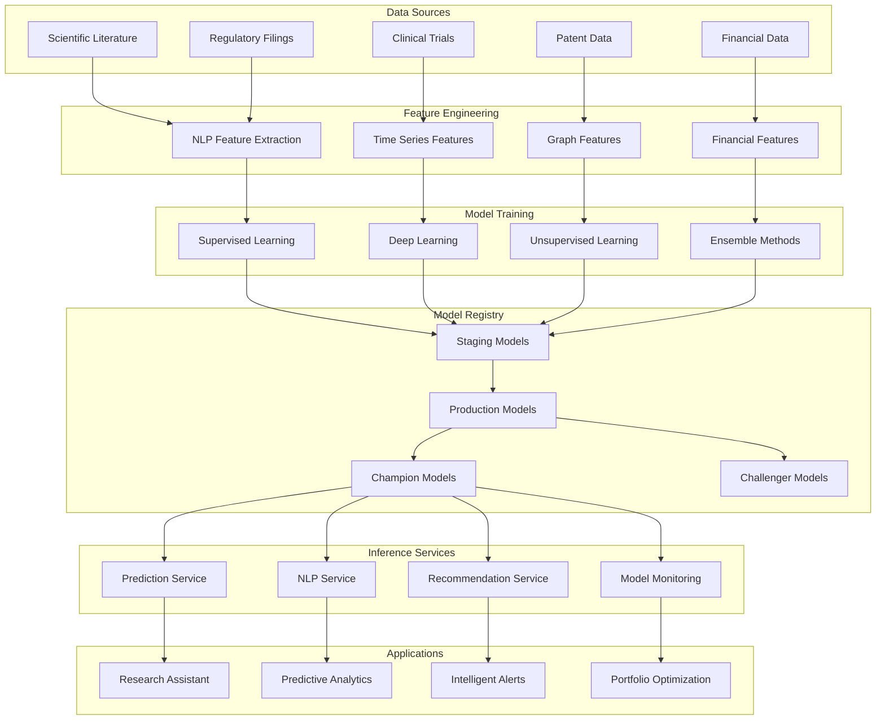

# BioInvest AI Copilot - AI/ML Architecture

## Overview

The AI/ML architecture for the BioInvest AI Copilot is designed to deliver intelligent automation, predictive analytics, and natural language understanding specifically tailored for biotech investment research. The system employs a multi-model approach combining specialized biomedical NLP models, predictive analytics, and reinforcement learning to provide accurate, explainable, and continuously improving AI capabilities.

## AI/ML Architecture Principles

### Core Principles
- **Domain Specialization**: Models fine-tuned for biomedical and financial domains
- **Explainable AI**: All predictions include interpretability and confidence scores
- **Human-AI Collaboration**: AI augments rather than replaces human expertise
- **Continuous Learning**: Models improve through user feedback and new data
- **Responsible AI**: Bias detection, fairness, and ethical AI practices

### Quality Standards
- **Prediction Accuracy**: >75% for binary clinical/regulatory outcomes
- **Response Time**: <2 seconds for real-time predictions
- **Model Reliability**: 99.9% uptime for critical inference services
- **Explainability**: Every prediction includes reasoning and confidence
- **Bias Mitigation**: Regular auditing for fairness across demographic groups

## ML System Architecture

### High-Level ML Pipeline



## Natural Language Processing Architecture

### Biomedical NLP Pipeline

#### Text Processing Pipeline
```python
# Biomedical NLP processing pipeline
from transformers import AutoTokenizer, AutoModel, pipeline
from spacy import load as spacy_load
import torch
from typing import Dict, List, Any

class BiomedicalNLP:
    def __init__(self):
        # Load specialized biomedical models
        self.tokenizer = AutoTokenizer.from_pretrained("microsoft/BiomedNLP-PubMedBERT-base-uncased-abstract")
        self.encoder = AutoModel.from_pretrained("microsoft/BiomedNLP-PubMedBERT-base-uncased-abstract")
        
        # Load BioBERT for NER
        self.ner_pipeline = pipeline(
            "ner",
            model="dmis-lab/biobert-v1.1",
            tokenizer="dmis-lab/biobert-v1.1",
            aggregation_strategy="simple"
        )
        
        # Load ScispaCy for scientific text processing
        self.nlp = spacy_load("en_core_sci_lg")
        
        # Custom entity types for investment relevance
        self.investment_entities = {
            'COMPANY': 'Pharmaceutical/biotech companies',
            'DRUG': 'Drug names and compounds',
            'INDICATION': 'Medical conditions and diseases',
            'TRIAL_PHASE': 'Clinical trial phases',
            'REGULATORY_EVENT': 'FDA/regulatory actions',
            'MARKET_SEGMENT': 'Therapeutic markets',
            'FINANCIAL_METRIC': 'Revenue, market size, etc.'
        }
    
    def extract_entities(self, text: str) -> Dict[str, List[Dict]]:
        """Extract biomedical and investment-relevant entities"""
        # Standard biomedical NER
        bio_entities = self.ner_pipeline(text)
        
        # Custom investment entity extraction
        doc = self.nlp(text)
        investment_entities = []
        
        for ent in doc.ents:
            if ent.label_ in ['ORG', 'PRODUCT', 'DISEASE', 'CHEMICAL']:
                investment_entities.append({
                    'text': ent.text,
                    'label': self._map_to_investment_entity(ent.label_),
                    'start': ent.start_char,
                    'end': ent.end_char,
                    'confidence': float(ent._.confidence) if hasattr(ent._, 'confidence') else 0.8
                })
        
        return {
            'biomedical_entities': bio_entities,
            'investment_entities': investment_entities,
            'entity_relationships': self._extract_relationships(doc)
        }
    
    def generate_embeddings(self, text: str) -> torch.Tensor:
        """Generate contextualized embeddings for biomedical text"""
        inputs = self.tokenizer(
            text, 
            return_tensors="pt", 
            max_length=512, 
            truncation=True, 
            padding=True
        )
        
        with torch.no_grad():
            outputs = self.encoder(**inputs)
            # Use CLS token embedding
            embeddings = outputs.last_hidden_state[:, 0, :]
            
        return embeddings
    
    def analyze_sentiment(self, text: str) -> Dict[str, float]:
        """Analyze investment sentiment in biomedical text"""
        # Custom sentiment analysis for biotech investment context
        sentiment_indicators = {
            'positive': ['breakthrough', 'promising', 'successful', 'approved', 'effective'],
            'negative': ['failed', 'discontinued', 'rejected', 'adverse', 'delayed'],
            'uncertainty': ['preliminary', 'ongoing', 'pending', 'inconclusive']
        }
        
        text_lower = text.lower()
        sentiment_scores = {}
        
        for sentiment, indicators in sentiment_indicators.items():
            score = sum(text_lower.count(indicator) for indicator in indicators)
            sentiment_scores[sentiment] = score / len(text.split()) if text.split() else 0
        
        return sentiment_scores
    
    def summarize_research(self, documents: List[str], max_length: int = 150) -> str:
        """Summarize multiple research documents"""
        summarizer = pipeline(
            "summarization",
            model="facebook/bart-large-cnn",
            max_length=max_length,
            min_length=50,
            do_sample=False
        )
        
        # Combine documents with priority weighting
        combined_text = " ".join(documents[:5])  # Limit to top 5 documents
        
        if len(combined_text) > 1024:
            # Truncate if too long
            combined_text = combined_text[:1024]
        
        summary = summarizer(combined_text)[0]['summary_text']
        return summary
```

### Investment-Specific Entity Recognition
```python
# Custom NER model for investment entities
from transformers import AutoTokenizer, AutoModelForTokenClassification
from transformers import TrainingArguments, Trainer
from torch.utils.data import Dataset
import torch

class InvestmentEntityDataset(Dataset):
    def __init__(self, texts, labels, tokenizer, max_length=128):
        self.texts = texts
        self.labels = labels
        self.tokenizer = tokenizer
        self.max_length = max_length
    
    def __len__(self):
        return len(self.texts)
    
    def __getitem__(self, idx):
        text = self.texts[idx]
        labels = self.labels[idx]
        
        # Tokenize and align labels
        encoding = self.tokenizer(
            text,
            truncation=True,
            padding='max_length',
            max_length=self.max_length,
            return_tensors='pt'
        )
        
        # Align labels with tokens
        aligned_labels = self._align_labels_with_tokens(text, labels, encoding)
        
        return {
            'input_ids': encoding['input_ids'].flatten(),
            'attention_mask': encoding['attention_mask'].flatten(),
            'labels': torch.tensor(aligned_labels, dtype=torch.long)
        }

class InvestmentNERModel:
    def __init__(self):
        self.model_name = "microsoft/BiomedNLP-PubMedBERT-base-uncased-abstract"
        self.tokenizer = AutoTokenizer.from_pretrained(self.model_name)
        
        # Investment-specific entity labels
        self.label_names = [
            'O',  # Outside
            'B-COMPANY', 'I-COMPANY',
            'B-DRUG', 'I-DRUG',
            'B-INDICATION', 'I-INDICATION',
            'B-PHASE', 'I-PHASE',
            'B-REGULATORY', 'I-REGULATORY',
            'B-FINANCIAL', 'I-FINANCIAL'
        ]
        
        self.label2id = {label: i for i, label in enumerate(self.label_names)}
        self.id2label = {i: label for label, i in self.label2id.items()}
        
        self.model = AutoModelForTokenClassification.from_pretrained(
            self.model_name,
            num_labels=len(self.label_names),
            id2label=self.id2label,
            label2id=self.label2id
        )
    
    def train(self, train_texts, train_labels, val_texts, val_labels):
        """Train custom NER model on investment data"""
        train_dataset = InvestmentEntityDataset(
            train_texts, train_labels, self.tokenizer
        )
        val_dataset = InvestmentEntityDataset(
            val_texts, val_labels, self.tokenizer
        )
        
        training_args = TrainingArguments(
            output_dir='./investment_ner_model',
            num_train_epochs=3,
            per_device_train_batch_size=16,
            per_device_eval_batch_size=16,
            warmup_steps=500,
            weight_decay=0.01,
            logging_dir='./logs',
            logging_steps=10,
            evaluation_strategy="epoch",
            save_strategy="epoch",
            load_best_model_at_end=True,
        )
        
        trainer = Trainer(
            model=self.model,
            args=training_args,
            train_dataset=train_dataset,
            eval_dataset=val_dataset,
            tokenizer=self.tokenizer
        )
        
        trainer.train()
        trainer.save_model()
```

## Predictive Analytics Architecture

### Clinical Trial Success Prediction
```python
# Clinical trial outcome prediction model
import pandas as pd
import numpy as np
from sklearn.ensemble import RandomForestClassifier, GradientBoostingClassifier
from sklearn.linear_model import LogisticRegression
from sklearn.preprocessing import StandardScaler, LabelEncoder
from sklearn.model_selection import train_test_split, cross_val_score
from sklearn.metrics import classification_report, roc_auc_score
import xgboost as xgb
import lightgbm as lgb

class ClinicalTrialPredictor:
    def __init__(self):
        self.models = {
            'logistic': LogisticRegression(random_state=42),
            'random_forest': RandomForestClassifier(n_estimators=200, random_state=42),
            'gradient_boost': GradientBoostingClassifier(random_state=42),
            'xgboost': xgb.XGBClassifier(random_state=42),
            'lightgbm': lgb.LGBMClassifier(random_state=42)
        }
        
        self.scaler = StandardScaler()
        self.label_encoders = {}
        self.feature_importance = {}
        self.best_model = None
    
    def prepare_features(self, df: pd.DataFrame) -> pd.DataFrame:
        """Engineer features for clinical trial prediction"""
        features = df.copy()
        
        # Temporal features
        features['trial_duration_days'] = (
            pd.to_datetime(features['completion_date']) - 
            pd.to_datetime(features['start_date'])
        ).dt.days
        
        features['years_since_start'] = (
            pd.Timestamp.now() - pd.to_datetime(features['start_date'])
        ).dt.days / 365.25
        
        # Enrollment features
        features['enrollment_ratio'] = features['actual_enrollment'] / features['target_enrollment']
        features['enrollment_per_site'] = features['actual_enrollment'] / features['num_sites']
        
        # Sponsor features
        features['is_big_pharma'] = features['sponsor'].isin([
            'Pfizer', 'Roche', 'Johnson & Johnson', 'Merck', 'Novartis',
            'AbbVie', 'Bristol Myers Squibb', 'AstraZeneca', 'GSK'
        ]).astype(int)
        
        # Indication features
        features['indication_prevalence'] = features['indication'].map(
            self._get_indication_prevalence()
        )
        
        # Historical success rate by sponsor
        features['sponsor_success_rate'] = features['sponsor'].map(
            self._calculate_sponsor_success_rates(df)
        )
        
        # Phase-specific features
        phase_success_rates = {
            'Phase I': 0.63,
            'Phase II': 0.30,
            'Phase III': 0.58,
            'Phase IV': 0.85
        }
        features['phase_base_success_rate'] = features['phase'].map(phase_success_rates)
        
        return features
    
    def train(self, df: pd.DataFrame, target_col: str = 'success'):
        """Train ensemble of models for trial success prediction"""
        # Prepare features
        features_df = self.prepare_features(df)
        
        # Select numerical and categorical features
        numerical_features = [
            'trial_duration_days', 'years_since_start', 'enrollment_ratio',
            'enrollment_per_site', 'indication_prevalence', 'sponsor_success_rate',
            'phase_base_success_rate', 'target_enrollment', 'num_sites'
        ]
        
        categorical_features = [
            'phase', 'indication_category', 'sponsor_type', 'is_big_pharma'
        ]
        
        # Handle categorical variables
        for col in categorical_features:
            if col in features_df.columns:
                le = LabelEncoder()
                features_df[col] = le.fit_transform(features_df[col].astype(str))
                self.label_encoders[col] = le
        
        # Prepare training data
        X = features_df[numerical_features + categorical_features]
        y = features_df[target_col]
        
        X_train, X_test, y_train, y_test = train_test_split(
            X, y, test_size=0.2, random_state=42, stratify=y
        )
        
        # Scale numerical features
        X_train_scaled = X_train.copy()
        X_test_scaled = X_test.copy()
        X_train_scaled[numerical_features] = self.scaler.fit_transform(X_train[numerical_features])
        X_test_scaled[numerical_features] = self.scaler.transform(X_test[numerical_features])
        
        # Train all models
        model_scores = {}
        for name, model in self.models.items():
            if name in ['logistic']:
                model.fit(X_train_scaled, y_train)
                y_pred_proba = model.predict_proba(X_test_scaled)[:, 1]
            else:
                model.fit(X_train, y_train)
                y_pred_proba = model.predict_proba(X_test)[:, 1]
            
            score = roc_auc_score(y_test, y_pred_proba)
            model_scores[name] = score
            
            # Store feature importance
            if hasattr(model, 'feature_importances_'):
                self.feature_importance[name] = dict(zip(X.columns, model.feature_importances_))
        
        # Select best model
        self.best_model = max(model_scores, key=model_scores.get)
        print(f"Best model: {self.best_model} with AUC: {model_scores[self.best_model]:.4f}")
        
        return model_scores
    
    def predict(self, df: pd.DataFrame) -> Dict[str, Any]:
        """Predict trial success probability with explanations"""
        features_df = self.prepare_features(df)
        
        # Get predictions from best model
        model = self.models[self.best_model]
        
        if self.best_model == 'logistic':
            X_scaled = self.scaler.transform(features_df[self.feature_columns])
            proba = model.predict_proba(X_scaled)[:, 1]
        else:
            proba = model.predict_proba(features_df[self.feature_columns])[:, 1]
        
        # Generate explanations
        explanations = self._generate_explanations(features_df, proba)
        
        return {
            'success_probability': proba.tolist(),
            'model_used': self.best_model,
            'confidence_interval': self._calculate_confidence_interval(proba),
            'explanations': explanations,
            'risk_factors': self._identify_risk_factors(features_df),
            'recommendations': self._generate_recommendations(features_df, proba)
        }
```

### FDA Approval Prediction Model
```python
# FDA approval prediction using historical data
import pandas as pd
import numpy as np
from sklearn.ensemble import RandomForestClassifier
from sklearn.model_selection import TimeSeriesSplit
from sklearn.metrics import precision_recall_curve, average_precision_score
import matplotlib.pyplot as plt

class FDAApprovalPredictor:
    def __init__(self):
        self.model = RandomForestClassifier(
            n_estimators=300,
            max_depth=15,
            min_samples_split=10,
            min_samples_leaf=5,
            random_state=42
        )
        
        self.feature_weights = {
            'clinical_data': 0.35,
            'safety_profile': 0.25,
            'regulatory_pathway': 0.20,
            'competitive_landscape': 0.10,
            'sponsor_history': 0.10
        }
    
    def engineer_features(self, df: pd.DataFrame) -> pd.DataFrame:
        """Create features for FDA approval prediction"""
        features = df.copy()
        
        # Clinical efficacy features
        features['primary_endpoint_met'] = (
            features['primary_endpoint_p_value'] < 0.05
        ).astype(int)
        
        features['effect_size'] = np.abs(features['hazard_ratio'] - 1) if 'hazard_ratio' in features else 0
        features['statistical_power'] = features['sample_size'] / features['estimated_required_sample']
        
        # Safety features
        features['serious_ae_rate'] = features['serious_adverse_events'] / features['safety_population']
        features['discontinuation_rate'] = features['discontinuations'] / features['safety_population']
        features['dose_limiting_toxicities'] = features['dlt_count'] / features['dose_escalation_cohorts']
        
        # Regulatory features
        features['fast_track'] = features['designation'].str.contains('Fast Track').astype(int)
        features['breakthrough'] = features['designation'].str.contains('Breakthrough').astype(int)
        features['orphan_status'] = features['designation'].str.contains('Orphan').astype(int)
        features['priority_review'] = features['designation'].str.contains('Priority').astype(int)
        
        # Unmet medical need
        features['unmet_need_score'] = self._calculate_unmet_need(features)
        
        # Competitive landscape
        features['approved_competitors'] = features['indication'].map(
            self._count_approved_competitors()
        )
        
        features['pipeline_competitors'] = features['indication'].map(
            self._count_pipeline_competitors()
        )
        
        # Sponsor track record
        features['sponsor_approval_rate'] = features['sponsor'].map(
            self._calculate_sponsor_approval_rate()
        )
        
        features['sponsor_experience'] = features['sponsor'].map(
            self._calculate_sponsor_experience()
        )
        
        return features
    
    def train(self, historical_data: pd.DataFrame):
        """Train FDA approval prediction model"""
        features_df = self.engineer_features(historical_data)
        
        # Time-based split to prevent data leakage
        tscv = TimeSeriesSplit(n_splits=5)
        
        feature_columns = [
            'primary_endpoint_met', 'effect_size', 'statistical_power',
            'serious_ae_rate', 'discontinuation_rate', 'dose_limiting_toxicities',
            'fast_track', 'breakthrough', 'orphan_status', 'priority_review',
            'unmet_need_score', 'approved_competitors', 'pipeline_competitors',
            'sponsor_approval_rate', 'sponsor_experience'
        ]
        
        X = features_df[feature_columns]
        y = features_df['approved']
        
        # Cross-validation with time series split
        cv_scores = []
        for train_idx, val_idx in tscv.split(X):
            X_train, X_val = X.iloc[train_idx], X.iloc[val_idx]
            y_train, y_val = y.iloc[train_idx], y.iloc[val_idx]
            
            self.model.fit(X_train, y_train)
            y_pred_proba = self.model.predict_proba(X_val)[:, 1]
            score = average_precision_score(y_val, y_pred_proba)
            cv_scores.append(score)
        
        # Final model training on all data
        self.model.fit(X, y)
        
        print(f"Cross-validation Average Precision: {np.mean(cv_scores):.4f} ± {np.std(cv_scores):.4f}")
        
        return cv_scores
    
    def predict_approval(self, drug_data: Dict[str, Any]) -> Dict[str, Any]:
        """Predict FDA approval probability with detailed reasoning"""
        # Convert to DataFrame for feature engineering
        df = pd.DataFrame([drug_data])
        features_df = self.engineer_features(df)
        
        # Get prediction
        approval_probability = self.model.predict_proba(features_df[self.feature_columns])[:, 1][0]
        
        # Generate detailed analysis
        analysis = {
            'approval_probability': float(approval_probability),
            'approval_category': self._categorize_approval_probability(approval_probability),
            'key_strengths': self._identify_strengths(features_df.iloc[0]),
            'key_weaknesses': self._identify_weaknesses(features_df.iloc[0]),
            'recommendations': self._generate_approval_recommendations(features_df.iloc[0]),
            'timeline_estimate': self._estimate_review_timeline(features_df.iloc[0]),
            'comparable_precedents': self._find_precedents(features_df.iloc[0])
        }
        
        return analysis
```

## Recommendation Systems

### Research Recommendation Engine
```python
# Intelligent research recommendation system
from sklearn.metrics.pairwise import cosine_similarity
from sklearn.decomposition import TruncatedSVD
import networkx as nx
from typing import List, Dict, Tuple

class ResearchRecommendationEngine:
    def __init__(self):
        self.user_profiles = {}
        self.content_embeddings = {}
        self.interaction_matrix = None
        self.graph = nx.Graph()
        
    def build_user_profile(self, user_id: str, interactions: List[Dict]) -> Dict[str, Any]:
        """Build user profile from research interactions"""
        profile = {
            'therapeutic_areas': {},
            'company_focus': {},
            'research_depth': 0,
            'preferred_content_types': {},
            'temporal_patterns': {}
        }
        
        for interaction in interactions:
            # Therapeutic area preferences
            if 'therapeutic_area' in interaction:
                area = interaction['therapeutic_area']
                profile['therapeutic_areas'][area] = profile['therapeutic_areas'].get(area, 0) + 1
            
            # Company focus
            if 'companies' in interaction:
                for company in interaction['companies']:
                    profile['company_focus'][company] = profile['company_focus'].get(company, 0) + 1
            
            # Research depth (time spent)
            if 'time_spent_minutes' in interaction:
                profile['research_depth'] += interaction['time_spent_minutes']
            
            # Content type preferences
            if 'content_type' in interaction:
                content_type = interaction['content_type']
                profile['preferred_content_types'][content_type] = \
                    profile['preferred_content_types'].get(content_type, 0) + 1
        
        # Normalize scores
        for category in ['therapeutic_areas', 'company_focus', 'preferred_content_types']:
            total = sum(profile[category].values())
            if total > 0:
                profile[category] = {k: v/total for k, v in profile[category].items()}
        
        self.user_profiles[user_id] = profile
        return profile
    
    def recommend_research_topics(self, user_id: str, n_recommendations: int = 10) -> List[Dict]:
        """Recommend research topics based on user profile and trends"""
        user_profile = self.user_profiles.get(user_id, {})
        
        # Content-based recommendations
        content_recs = self._content_based_recommendations(user_profile)
        
        # Collaborative filtering recommendations
        collab_recs = self._collaborative_recommendations(user_id)
        
        # Graph-based recommendations (knowledge graph)
        graph_recs = self._graph_based_recommendations(user_profile)
        
        # Trending topics
        trending_recs = self._trending_recommendations()
        
        # Combine and rank recommendations
        all_recs = self._combine_recommendations([
            (content_recs, 0.4),
            (collab_recs, 0.3),
            (graph_recs, 0.2),
            (trending_recs, 0.1)
        ])
        
        # Re-rank based on business value and novelty
        final_recs = self._rerank_recommendations(all_recs, user_profile)
        
        return final_recs[:n_recommendations]
    
    def _content_based_recommendations(self, user_profile: Dict) -> List[Dict]:
        """Generate recommendations based on user content preferences"""
        recommendations = []
        
        # Find similar content based on therapeutic areas
        for area, weight in user_profile.get('therapeutic_areas', {}).items():
            # Find related therapeutic areas and emerging research
            related_content = self._find_related_therapeutic_content(area)
            for content in related_content:
                recommendations.append({
                    'content': content,
                    'score': weight * content.get('relevance_score', 0.5),
                    'reason': f"Related to your interest in {area}",
                    'type': 'content_based'
                })
        
        return sorted(recommendations, key=lambda x: x['score'], reverse=True)
    
    def _collaborative_recommendations(self, user_id: str) -> List[Dict]:
        """Generate recommendations based on similar users"""
        if self.interaction_matrix is None:
            return []
        
        # Find similar users using matrix factorization
        svd = TruncatedSVD(n_components=50)
        user_factors = svd.fit_transform(self.interaction_matrix)
        
        # Calculate user similarity
        user_idx = self._get_user_index(user_id)
        if user_idx is None:
            return []
        
        user_vec = user_factors[user_idx].reshape(1, -1)
        similarities = cosine_similarity(user_vec, user_factors)[0]
        
        # Find top similar users
        similar_users = np.argsort(similarities)[::-1][1:6]  # Top 5 similar users
        
        recommendations = []
        for similar_user_idx in similar_users:
            similar_user_id = self._get_user_id_from_index(similar_user_idx)
            similar_profile = self.user_profiles.get(similar_user_id, {})
            
            # Recommend content that similar users engaged with
            for area, weight in similar_profile.get('therapeutic_areas', {}).items():
                if area not in self.user_profiles[user_id].get('therapeutic_areas', {}):
                    recommendations.append({
                        'content': {'therapeutic_area': area},
                        'score': weight * similarities[similar_user_idx],
                        'reason': f"Users with similar interests also research {area}",
                        'type': 'collaborative'
                    })
        
        return recommendations
    
    def _graph_based_recommendations(self, user_profile: Dict) -> List[Dict]:
        """Generate recommendations using knowledge graph relationships"""
        recommendations = []
        
        # Use PageRank to find important nodes related to user interests
        for area in user_profile.get('therapeutic_areas', {}).keys():
            if area in self.graph:
                # Find connected nodes with high centrality
                neighbors = list(self.graph.neighbors(area))
                for neighbor in neighbors:
                    centrality = nx.betweenness_centrality(self.graph)[neighbor]
                    recommendations.append({
                        'content': {'entity': neighbor, 'type': 'related_entity'},
                        'score': centrality,
                        'reason': f"Connected to {area} in knowledge graph",
                        'type': 'graph_based'
                    })
        
        return sorted(recommendations, key=lambda x: x['score'], reverse=True)
```

## Model Operations (MLOps)

### Model Training and Deployment Pipeline
```python
# MLOps pipeline for model lifecycle management
import mlflow
import mlflow.sklearn
import mlflow.pytorch
from mlflow.tracking import MlflowClient
import joblib
import torch
from typing import Dict, Any, Optional
import yaml

class MLOpsPipeline:
    def __init__(self, experiment_name: str):
        self.experiment_name = experiment_name
        self.client = MlflowClient()
        
        # Set up MLflow experiment
        try:
            experiment_id = self.client.create_experiment(experiment_name)
        except:
            experiment = self.client.get_experiment_by_name(experiment_name)
            experiment_id = experiment.experiment_id
            
        mlflow.set_experiment(experiment_id)
    
    def train_and_register_model(self, 
                                 model: Any,
                                 X_train: Any,
                                 y_train: Any,
                                 X_val: Any,
                                 y_val: Any,
                                 model_name: str,
                                 hyperparameters: Dict[str, Any],
                                 metrics: Dict[str, float]) -> str:
        """Train model and register in model registry"""
        
        with mlflow.start_run() as run:
            # Log hyperparameters
            mlflow.log_params(hyperparameters)
            
            # Train model
            model.fit(X_train, y_train)
            
            # Evaluate model
            train_score = model.score(X_train, y_train)
            val_score = model.score(X_val, y_val)
            
            # Log metrics
            mlflow.log_metric("train_score", train_score)
            mlflow.log_metric("val_score", val_score)
            for metric_name, metric_value in metrics.items():
                mlflow.log_metric(metric_name, metric_value)
            
            # Log model
            if hasattr(model, 'predict_proba'):
                mlflow.sklearn.log_model(
                    model,
                    "model",
                    registered_model_name=model_name
                )
            else:
                mlflow.pytorch.log_model(
                    model,
                    "model",
                    registered_model_name=model_name
                )
            
            # Log model artifacts
            self._save_model_artifacts(model, run.info.run_id)
            
            return run.info.run_id
    
    def promote_model(self, model_name: str, version: str, stage: str):
        """Promote model to different stage (staging/production)"""
        self.client.transition_model_version_stage(
            name=model_name,
            version=version,
            stage=stage
        )
        
        print(f"Model {model_name} version {version} promoted to {stage}")
    
    def compare_models(self, model_name: str, metric: str = "val_score") -> Dict[str, Any]:
        """Compare different versions of a model"""
        versions = self.client.search_model_versions(f"name='{model_name}'")
        
        comparison = []
        for version in versions:
            run_id = version.run_id
            run = self.client.get_run(run_id)
            
            comparison.append({
                'version': version.version,
                'stage': version.current_stage,
                'metric_value': run.data.metrics.get(metric, 0),
                'run_id': run_id,
                'creation_timestamp': version.creation_timestamp
            })
        
        # Sort by metric value
        comparison.sort(key=lambda x: x['metric_value'], reverse=True)
        return comparison
    
    def deploy_model(self, model_name: str, version: str, deployment_config: Dict[str, Any]):
        """Deploy model to serving infrastructure"""
        # Load model
        model_uri = f"models:/{model_name}/{version}"
        model = mlflow.sklearn.load_model(model_uri)
        
        # Create deployment configuration
        deployment_spec = {
            'model_name': model_name,
            'model_version': version,
            'model_uri': model_uri,
            'deployment_config': deployment_config,
            'serving_config': self._create_serving_config(model, deployment_config)
        }
        
        # Deploy to Kubernetes or cloud platform
        self._deploy_to_platform(deployment_spec)
        
        return deployment_spec
    
    def _create_serving_config(self, model: Any, config: Dict[str, Any]) -> Dict[str, Any]:
        """Create serving configuration for model deployment"""
        return {
            'container_image': 'bioinvest/ml-serving:latest',
            'resources': {
                'cpu': config.get('cpu', '500m'),
                'memory': config.get('memory', '1Gi'),
                'gpu': config.get('gpu', 0)
            },
            'scaling': {
                'min_replicas': config.get('min_replicas', 1),
                'max_replicas': config.get('max_replicas', 10),
                'target_cpu_utilization': 70
            },
            'health_checks': {
                'readiness_probe': '/health/ready',
                'liveness_probe': '/health/live'
            }
        }
```

### Model Monitoring and Observability
```python
# Model monitoring and performance tracking
import numpy as np
import pandas as pd
from datetime import datetime, timedelta
from typing import Dict, List, Any, Optional
import logging

class ModelMonitor:
    def __init__(self, model_name: str):
        self.model_name = model_name
        self.performance_history = []
        self.drift_detectors = {}
        self.alert_thresholds = {
            'accuracy_drop': 0.05,  # 5% accuracy drop triggers alert
            'prediction_drift': 0.1,  # 10% drift in predictions
            'data_drift': 0.15,  # 15% drift in input features
            'latency_increase': 2.0  # 2x latency increase
        }
        
        self.logger = logging.getLogger(f"model_monitor_{model_name}")
    
    def log_prediction(self, 
                      inputs: Dict[str, Any],
                      prediction: Any,
                      confidence: float,
                      latency_ms: float,
                      timestamp: Optional[datetime] = None):
        """Log individual prediction for monitoring"""
        if timestamp is None:
            timestamp = datetime.utcnow()
        
        prediction_log = {
            'timestamp': timestamp,
            'inputs': inputs,
            'prediction': prediction,
            'confidence': confidence,
            'latency_ms': latency_ms,
            'model_version': self._get_current_model_version()
        }
        
        # Store in monitoring database
        self._store_prediction_log(prediction_log)
        
        # Check for real-time anomalies
        self._check_prediction_anomaly(prediction_log)
    
    def log_ground_truth(self,
                        prediction_id: str,
                        actual_outcome: Any,
                        feedback_timestamp: Optional[datetime] = None):
        """Log actual outcome for prediction accuracy tracking"""
        if feedback_timestamp is None:
            feedback_timestamp = datetime.utcnow()
        
        ground_truth_log = {
            'prediction_id': prediction_id,
            'actual_outcome': actual_outcome,
            'feedback_timestamp': feedback_timestamp
        }
        
        # Update prediction record with ground truth
        self._update_prediction_with_truth(ground_truth_log)
        
        # Calculate recent accuracy metrics
        self._update_accuracy_metrics()
    
    def detect_data_drift(self, recent_data: pd.DataFrame) -> Dict[str, Any]:
        """Detect drift in input data distribution"""
        drift_results = {}
        
        # Compare with reference dataset
        reference_data = self._load_reference_dataset()
        
        for column in recent_data.columns:
            if column in reference_data.columns:
                # Statistical drift detection
                if recent_data[column].dtype in ['int64', 'float64']:
                    # KS test for numerical features
                    from scipy.stats import ks_2samp
                    ks_statistic, p_value = ks_2samp(
                        reference_data[column].dropna(),
                        recent_data[column].dropna()
                    )
                    
                    drift_results[column] = {
                        'drift_score': ks_statistic,
                        'p_value': p_value,
                        'significant_drift': p_value < 0.05,
                        'method': 'ks_test'
                    }
                else:
                    # Chi-square test for categorical features
                    from scipy.stats import chi2_contingency
                    
                    # Create contingency table
                    ref_counts = reference_data[column].value_counts()
                    recent_counts = recent_data[column].value_counts()
                    
                    # Align indices
                    all_categories = set(ref_counts.index) | set(recent_counts.index)
                    ref_aligned = [ref_counts.get(cat, 0) for cat in all_categories]
                    recent_aligned = [recent_counts.get(cat, 0) for cat in all_categories]
                    
                    if sum(ref_aligned) > 0 and sum(recent_aligned) > 0:
                        chi2_stat, p_value, _, _ = chi2_contingency([ref_aligned, recent_aligned])
                        
                        drift_results[column] = {
                            'drift_score': chi2_stat,
                            'p_value': p_value,
                            'significant_drift': p_value < 0.05,
                            'method': 'chi2_test'
                        }
        
        # Overall drift assessment
        significant_drifts = sum(1 for result in drift_results.values() 
                               if result['significant_drift'])
        
        overall_drift = {
            'total_features': len(drift_results),
            'drifted_features': significant_drifts,
            'drift_percentage': significant_drifts / len(drift_results) if drift_results else 0,
            'severity': self._assess_drift_severity(significant_drifts, len(drift_results))
        }
        
        return {
            'feature_drift': drift_results,
            'overall_drift': overall_drift,
            'timestamp': datetime.utcnow(),
            'recommendations': self._generate_drift_recommendations(drift_results)
        }
    
    def generate_model_report(self, days: int = 30) -> Dict[str, Any]:
        """Generate comprehensive model performance report"""
        end_date = datetime.utcnow()
        start_date = end_date - timedelta(days=days)
        
        # Get performance metrics
        accuracy_trend = self._get_accuracy_trend(start_date, end_date)
        latency_trend = self._get_latency_trend(start_date, end_date)
        volume_trend = self._get_prediction_volume_trend(start_date, end_date)
        
        # Get drift analysis
        recent_data = self._get_recent_prediction_data(days=7)
        drift_analysis = self.detect_data_drift(recent_data)
        
        # Calculate business impact metrics
        business_metrics = self._calculate_business_metrics(start_date, end_date)
        
        report = {
            'model_name': self.model_name,
            'report_period': {
                'start_date': start_date.isoformat(),
                'end_date': end_date.isoformat(),
                'days': days
            },
            'performance_summary': {
                'current_accuracy': accuracy_trend[-1] if accuracy_trend else None,
                'accuracy_trend': 'improving' if self._is_improving_trend(accuracy_trend) else 'declining',
                'average_latency_ms': np.mean(latency_trend) if latency_trend else None,
                'total_predictions': sum(volume_trend) if volume_trend else 0
            },
            'drift_analysis': drift_analysis,
            'business_impact': business_metrics,
            'recommendations': self._generate_model_recommendations(accuracy_trend, drift_analysis),
            'alerts': self._get_recent_alerts(days),
            'generated_at': datetime.utcnow().isoformat()
        }
        
        return report
```

## AI Ethics and Explainability

### Explainable AI Framework
```python
# Explainable AI for biotech investment predictions
import shap
import lime
from lime.lime_text import LimeTextExplainer
from lime.lime_tabular import LimeTabularExplainer
import pandas as pd
import numpy as np

class ExplainableAI:
    def __init__(self, model, model_type: str = 'tree'):
        self.model = model
        self.model_type = model_type
        
        # Initialize explainers based on model type
        if model_type == 'tree':
            self.explainer = shap.TreeExplainer(model)
        elif model_type == 'linear':
            self.explainer = shap.LinearExplainer(model)
        else:
            self.explainer = shap.KernelExplainer(model.predict_proba)
        
        self.lime_explainer = None
        self.feature_names = None
    
    def explain_prediction(self, 
                          input_data: pd.DataFrame,
                          prediction_index: int = 0,
                          explanation_type: str = 'shap') -> Dict[str, Any]:
        """Generate explanation for a specific prediction"""
        
        if explanation_type == 'shap':
            return self._shap_explanation(input_data, prediction_index)
        elif explanation_type == 'lime':
            return self._lime_explanation(input_data, prediction_index)
        else:
            raise ValueError(f"Unsupported explanation type: {explanation_type}")
    
    def _shap_explanation(self, input_data: pd.DataFrame, index: int) -> Dict[str, Any]:
        """Generate SHAP-based explanation"""
        # Calculate SHAP values
        shap_values = self.explainer.shap_values(input_data)
        
        # Handle binary classification (get positive class SHAP values)
        if isinstance(shap_values, list):
            shap_values = shap_values[1]  # Positive class
        
        # Get explanation for specific instance
        instance_shap_values = shap_values[index]
        instance_data = input_data.iloc[index]
        
        # Create feature importance ranking
        feature_importance = []
        for i, (feature, value, shap_val) in enumerate(zip(
            input_data.columns, instance_data.values, instance_shap_values
        )):
            feature_importance.append({
                'feature': feature,
                'value': float(value) if pd.notna(value) else None,
                'shap_value': float(shap_val),
                'contribution': 'positive' if shap_val > 0 else 'negative',
                'magnitude': abs(float(shap_val))
            })
        
        # Sort by absolute SHAP value
        feature_importance.sort(key=lambda x: x['magnitude'], reverse=True)
        
        # Generate natural language explanation
        explanation_text = self._generate_explanation_text(feature_importance[:5])
        
        return {
            'method': 'SHAP',
            'base_value': float(self.explainer.expected_value),
            'prediction_value': float(self.model.predict_proba(input_data.iloc[[index]])[:, 1][0]),
            'feature_importance': feature_importance,
            'top_positive_factors': [f for f in feature_importance if f['contribution'] == 'positive'][:3],
            'top_negative_factors': [f for f in feature_importance if f['contribution'] == 'negative'][:3],
            'explanation_text': explanation_text,
            'confidence': 'high' if max(f['magnitude'] for f in feature_importance) > 0.1 else 'medium'
        }
    
    def _generate_explanation_text(self, top_features: List[Dict]) -> str:
        """Generate human-readable explanation from feature importance"""
        explanation = "This prediction is primarily based on the following factors:\n\n"
        
        for i, feature in enumerate(top_features, 1):
            feature_name = feature['feature'].replace('_', ' ').title()
            contribution = feature['contribution']
            magnitude = feature['magnitude']
            
            if contribution == 'positive':
                explanation += f"{i}. {feature_name} (value: {feature['value']:.3f}) strongly supports this prediction "
                explanation += f"(impact: +{magnitude:.3f})\n"
            else:
                explanation += f"{i}. {feature_name} (value: {feature['value']:.3f}) works against this prediction "
                explanation += f"(impact: -{magnitude:.3f})\n"
        
        return explanation
    
    def generate_bias_report(self, 
                           test_data: pd.DataFrame,
                           protected_attributes: List[str]) -> Dict[str, Any]:
        """Generate bias analysis report for model predictions"""
        bias_metrics = {}
        
        predictions = self.model.predict_proba(test_data)[:, 1]
        
        for attr in protected_attributes:
            if attr in test_data.columns:
                # Calculate fairness metrics by group
                groups = test_data[attr].unique()
                group_metrics = {}
                
                for group in groups:
                    group_mask = test_data[attr] == group
                    group_predictions = predictions[group_mask]
                    
                    group_metrics[str(group)] = {
                        'sample_size': int(np.sum(group_mask)),
                        'mean_prediction': float(np.mean(group_predictions)),
                        'std_prediction': float(np.std(group_predictions)),
                        'positive_rate': float(np.mean(group_predictions > 0.5))
                    }
                
                # Calculate disparate impact
                group_rates = [metrics['positive_rate'] for metrics in group_metrics.values()]
                disparate_impact = min(group_rates) / max(group_rates) if max(group_rates) > 0 else 0
                
                bias_metrics[attr] = {
                    'group_metrics': group_metrics,
                    'disparate_impact': disparate_impact,
                    'bias_detected': disparate_impact < 0.8,  # 80% rule
                    'severity': 'high' if disparate_impact < 0.6 else 'medium' if disparate_impact < 0.8 else 'low'
                }
        
        return {
            'bias_analysis': bias_metrics,
            'overall_bias_score': np.mean([m['disparate_impact'] for m in bias_metrics.values()]),
            'recommendations': self._generate_bias_mitigation_recommendations(bias_metrics),
            'analysis_date': datetime.utcnow().isoformat()
        }
```

This comprehensive AI/ML architecture provides the foundation for intelligent, explainable, and responsible AI capabilities within the BioInvest AI Copilot platform. The system is designed to continuously learn and improve while maintaining transparency and ethical standards in all AI-driven decisions and recommendations.