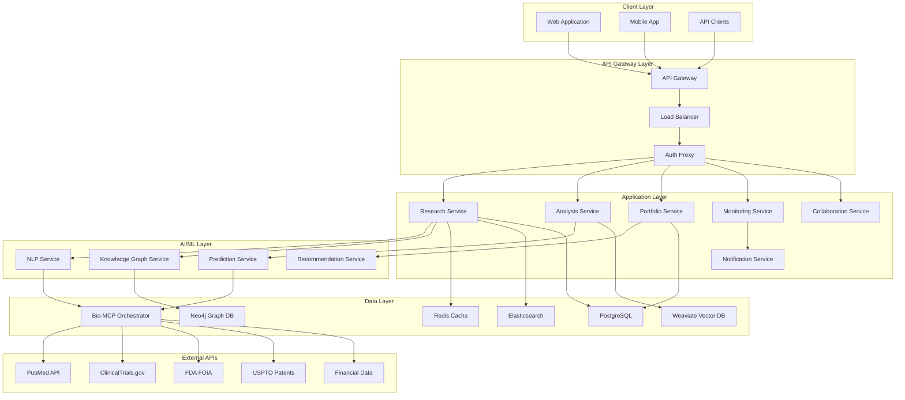
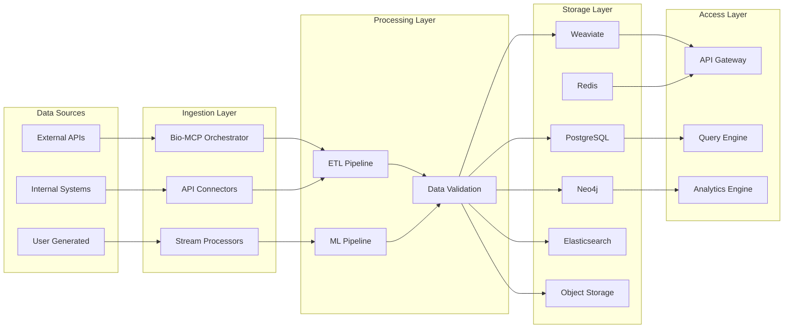
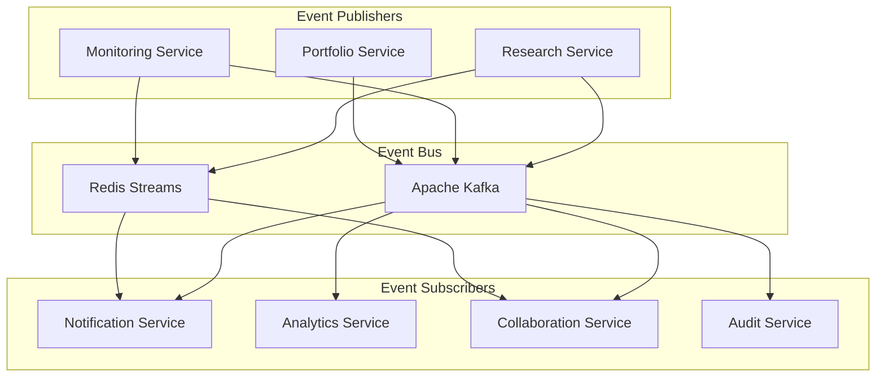

# BioInvest AI Copilot - System Architecture

## Overview

The BioInvest AI Copilot is built on a modern, cloud-native architecture designed for scalability, reliability, and performance. The system leverages microservices architecture, event-driven communication, and containerized deployment to deliver a responsive and intelligent platform for biotech investment research.

## Architecture Principles

### Core Design Principles
- **Domain-Driven Design**: Services organized around business domains
- **Event-Driven Architecture**: Asynchronous communication between services
- **API-First**: All services expose well-defined APIs
- **Cloud-Native**: Built for containerized, elastic deployment
- **Security by Design**: Security controls embedded at every layer
- **Observability**: Comprehensive monitoring, logging, and tracing

### Quality Attributes
- **Scalability**: Horizontal scaling to support 10,000+ concurrent users
- **Availability**: 99.9% uptime with <100ms P95 response times
- **Security**: Enterprise-grade security with SOC2 compliance
- **Maintainability**: Modular design enabling independent service updates
- **Extensibility**: Plugin architecture for custom integrations

## High-Level System Architecture



## Service Architecture

### Core Application Services

#### Research Service
**Purpose**: Manages research workflows, query processing, and result synthesis
**Responsibilities**:
- Natural language query processing and entity extraction
- Multi-source data aggregation and synthesis
- Research project management and collaboration
- Report generation and export functionality

**Technology Stack**:
- **Runtime**: Python 3.12 with FastAPI
- **Dependencies**: Bio-MCP client, NLP service, Knowledge Graph service
- **Storage**: PostgreSQL (metadata), Redis (cache), Elasticsearch (search)
- **Deployment**: Docker containers on Kubernetes

**API Endpoints**:
```
POST   /research/queries                # Submit new research query
GET    /research/queries/{id}           # Get query status and results
POST   /research/projects               # Create research project
GET    /research/projects/{id}/reports  # Generate research reports
```

#### Analysis Service
**Purpose**: Provides predictive analytics and quantitative modeling capabilities
**Responsibilities**:
- Clinical trial success prediction
- FDA approval likelihood modeling
- Market opportunity sizing and competitive analysis
- Risk assessment and scenario planning

**Technology Stack**:
- **Runtime**: Python 3.12 with FastAPI
- **ML Framework**: PyTorch, scikit-learn, XGBoost
- **Dependencies**: Prediction service, Bio-MCP orchestrator
- **Storage**: PostgreSQL (models), Weaviate (vectors), Redis (cache)

**API Endpoints**:
```
POST   /analysis/predictions            # Generate predictions
GET    /analysis/models                 # List available models
POST   /analysis/scenarios              # Run scenario analysis
GET    /analysis/risk-assessments/{id}  # Get risk assessment
```

#### Portfolio Service
**Purpose**: Manages portfolio data, analytics, and optimization
**Responsibilities**:
- Portfolio position tracking and synchronization
- Risk analytics and correlation analysis
- Performance attribution and benchmarking
- Catalyst calendar and event tracking

**Technology Stack**:
- **Runtime**: Python 3.12 with FastAPI
- **Analytics**: NumPy, Pandas, QuantLib
- **Dependencies**: External portfolio APIs, Analysis service
- **Storage**: PostgreSQL (positions), TimescaleDB (time series)

**API Endpoints**:
```
GET    /portfolio/positions             # Get current positions
POST   /portfolio/analysis              # Run portfolio analysis
GET    /portfolio/risk-metrics          # Get risk analytics
POST   /portfolio/optimization          # Portfolio optimization
```

#### Monitoring Service
**Purpose**: Real-time event detection and alerting system
**Responsibilities**:
- Continuous monitoring of biomedical and financial data sources
- Event classification and priority scoring
- Alert routing and notification management
- Watchlist management and customization

**Technology Stack**:
- **Runtime**: Python 3.12 with FastAPI
- **Streaming**: Apache Kafka, Redis Streams
- **Dependencies**: Bio-MCP orchestrator, NLP service
- **Storage**: PostgreSQL (alerts), Redis (real-time data)

**API Endpoints**:
```
GET    /monitoring/alerts               # Get active alerts
POST   /monitoring/watchlists           # Create/update watchlist
GET    /monitoring/events/{id}          # Get event details
POST   /monitoring/subscriptions        # Subscribe to alerts
```

#### Collaboration Service
**Purpose**: Enables team collaboration and knowledge sharing
**Responsibilities**:
- Shared workspace management
- Comment and annotation system
- Research sharing and permissions
- Activity feeds and notifications

**Technology Stack**:
- **Runtime**: Node.js with Express.js
- **Real-time**: WebSocket, Socket.io
- **Dependencies**: Research service, Notification service
- **Storage**: PostgreSQL (collaboration data), Redis (sessions)

**API Endpoints**:
```
POST   /collaboration/workspaces        # Create workspace
GET    /collaboration/workspaces/{id}   # Get workspace details
POST   /collaboration/comments          # Add comment/annotation
GET    /collaboration/activity          # Get activity feed
```

### AI/ML Services

#### NLP Service
**Purpose**: Natural language processing for biomedical text
**Responsibilities**:
- Named entity recognition (companies, drugs, diseases)
- Relationship extraction from scientific literature
- Sentiment analysis and opinion mining
- Text summarization and synthesis

**Technology Stack**:
- **Runtime**: Python 3.12 with FastAPI
- **ML Models**: BioBERT, SciBERT, Custom transformers
- **Framework**: Hugging Face Transformers, spaCy
- **Storage**: Model registry (MLflow), Vector storage (Weaviate)

**Key Features**:
- Biomedical entity extraction with 95%+ accuracy
- Real-time processing with <500ms latency
- Custom model fine-tuning for investment-specific terminology
- Multi-language support (English, scientific Latin)

#### Prediction Service
**Purpose**: Machine learning models for investment predictions
**Responsibilities**:
- Clinical trial success probability modeling
- FDA approval likelihood prediction
- Market opportunity sizing and forecasting
- Investment outcome prediction

**Technology Stack**:
- **Runtime**: Python 3.12 with FastAPI
- **ML Frameworks**: PyTorch, scikit-learn, XGBoost, LightGBM
- **MLOps**: MLflow, Weights & Biases, Kubeflow
- **Storage**: Model artifacts (S3), Feature store (Redis)

**Model Types**:
- **Classification**: Binary outcome prediction (approval/rejection)
- **Regression**: Continuous value prediction (market size, timeline)
- **Time Series**: Sequential pattern analysis (stock performance)
- **Deep Learning**: Complex pattern recognition (document analysis)

#### Knowledge Graph Service
**Purpose**: Manages biomedical knowledge graph and relationship analysis
**Responsibilities**:
- Entity relationship modeling and storage
- Graph traversal and pattern discovery
- Semantic search and recommendation
- Knowledge base maintenance and updates

**Technology Stack**:
- **Runtime**: Python 3.12 with FastAPI
- **Graph Database**: Neo4j
- **Graph Analytics**: NetworkX, graph-tool
- **Search**: Elasticsearch with graph queries

**Graph Schema**:
```
Company -[:DEVELOPS]-> Drug -[:TARGETS]-> Disease
Company -[:SPONSORS]-> ClinicalTrial -[:STUDIES]-> Drug
Researcher -[:AUTHORS]-> Publication -[:CITES]-> Drug
Patent -[:PROTECTS]-> Drug -[:COMPETES_WITH]-> Drug
```

## Data Architecture

### Data Flow Architecture



### Database Design

#### PostgreSQL (Primary Database)
**Schema Design**:
```sql
-- Core entities
CREATE TABLE organizations (
    id UUID PRIMARY KEY,
    name VARCHAR(255) NOT NULL,
    domain VARCHAR(100),
    settings JSONB,
    created_at TIMESTAMP DEFAULT NOW()
);

CREATE TABLE users (
    id UUID PRIMARY KEY,
    organization_id UUID REFERENCES organizations(id),
    email VARCHAR(255) UNIQUE NOT NULL,
    role VARCHAR(50) NOT NULL,
    preferences JSONB,
    created_at TIMESTAMP DEFAULT NOW()
);

-- Research entities
CREATE TABLE research_queries (
    id UUID PRIMARY KEY,
    user_id UUID REFERENCES users(id),
    query_text TEXT NOT NULL,
    extracted_entities JSONB,
    status VARCHAR(50) DEFAULT 'pending',
    results JSONB,
    created_at TIMESTAMP DEFAULT NOW()
);

CREATE TABLE companies (
    id UUID PRIMARY KEY,
    name VARCHAR(255) NOT NULL,
    ticker VARCHAR(10),
    market_cap BIGINT,
    pipeline JSONB,
    metadata JSONB,
    updated_at TIMESTAMP DEFAULT NOW()
);

-- Portfolio entities
CREATE TABLE portfolios (
    id UUID PRIMARY KEY,
    organization_id UUID REFERENCES organizations(id),
    name VARCHAR(255) NOT NULL,
    description TEXT,
    positions JSONB,
    created_at TIMESTAMP DEFAULT NOW()
);

-- Collaboration entities
CREATE TABLE workspaces (
    id UUID PRIMARY KEY,
    organization_id UUID REFERENCES organizations(id),
    name VARCHAR(255) NOT NULL,
    members JSONB,
    permissions JSONB,
    created_at TIMESTAMP DEFAULT NOW()
);
```

#### Neo4j (Knowledge Graph)
**Node Types**:
- Company, Drug, Disease, ClinicalTrial, Researcher, Publication, Patent
- Regulatory Action, Market Segment, Investment Theme

**Relationship Types**:
- DEVELOPS, SPONSORS, TARGETS, COMPETES_WITH, COLLABORATES_WITH
- AUTHORS, CITES, REFERENCES, MENTIONS, INFLUENCES

#### Weaviate (Vector Database)
**Collections**:
- Publications: Biomedical literature with embeddings
- Company Profiles: Company descriptions and analysis
- Drug Profiles: Drug mechanism and indication vectors
- Market Intelligence: News and analysis with semantic vectors

### Caching Strategy

#### Multi-Layer Caching
1. **CDN Layer**: Static assets and public content (CloudFlare)
2. **API Gateway Cache**: Frequently accessed API responses (5-60 seconds)
3. **Application Cache**: Service-specific caching (Redis, 5-30 minutes)
4. **Database Cache**: Query result caching (PostgreSQL, Redis)

#### Cache Invalidation
- **Time-based**: TTL for different data types (real-time: 30s, static: 24h)
- **Event-based**: Cache invalidation on data updates
- **Dependency-based**: Cascading invalidation for related data

## Communication Architecture

### Synchronous Communication
- **REST APIs**: Primary interface between services and clients
- **GraphQL**: Flexible data fetching for complex queries
- **gRPC**: High-performance internal service communication

### Asynchronous Communication
- **Message Queues**: Redis for lightweight messaging
- **Event Streaming**: Apache Kafka for high-throughput event processing
- **WebSockets**: Real-time updates for collaboration and monitoring

### Event-Driven Architecture



### Event Types
- **research.query.submitted**: New research query initiated
- **research.query.completed**: Research query finished processing
- **alert.high_priority.triggered**: Critical alert generated
- **portfolio.position.updated**: Portfolio position changed
- **collaboration.comment.added**: New comment or annotation

## Security Architecture

### Authentication & Authorization
- **Authentication**: JWT tokens with refresh token rotation
- **Authorization**: Role-based access control (RBAC) with attribute-based extensions
- **Multi-factor Authentication**: Time-based OTP for sensitive operations
- **Single Sign-On**: SAML 2.0 and OIDC integration

### Data Security
- **Encryption at Rest**: AES-256 for databases and file storage
- **Encryption in Transit**: TLS 1.3 for all communications
- **Key Management**: AWS KMS/HashiCorp Vault for encryption keys
- **Data Masking**: PII protection in non-production environments

### Network Security
- **VPC**: Isolated network environment with private subnets
- **WAF**: Web application firewall for DDoS and attack protection
- **Service Mesh**: Istio for service-to-service security and observability
- **Zero Trust**: All communications verified and encrypted

## Deployment Architecture

### Container Orchestration
```yaml
# Kubernetes deployment example
apiVersion: apps/v1
kind: Deployment
metadata:
  name: research-service
spec:
  replicas: 3
  selector:
    matchLabels:
      app: research-service
  template:
    metadata:
      labels:
        app: research-service
    spec:
      containers:
      - name: research-service
        image: bioinvest/research-service:v1.0.0
        ports:
        - containerPort: 8000
        env:
        - name: DATABASE_URL
          valueFrom:
            secretKeyRef:
              name: database-secrets
              key: url
        resources:
          requests:
            memory: "512Mi"
            cpu: "250m"
          limits:
            memory: "1Gi"
            cpu: "500m"
```

### Infrastructure as Code
- **Terraform**: Infrastructure provisioning and management
- **Helm**: Kubernetes application package management
- **GitOps**: ArgoCD for continuous deployment
- **Configuration Management**: ConfigMaps and Secrets in Kubernetes

### CI/CD Pipeline

```mermaid
graph LR
    DEV[Developer] --> GIT[Git Repository]
    GIT --> BUILD[Build Pipeline]
    BUILD --> TEST[Test Suite]
    TEST --> SECURITY[Security Scan]
    SECURITY --> DEPLOY_DEV[Deploy to Dev]
    DEPLOY_DEV --> INTEGRATION[Integration Tests]
    INTEGRATION --> DEPLOY_STAGING[Deploy to Staging]
    DEPLOY_STAGING --> MANUAL[Manual Approval]
    MANUAL --> DEPLOY_PROD[Deploy to Production]
```


## Monitoring & Observability

### Three Pillars of Observability

#### Metrics
- **Application Metrics**: Response times, error rates, throughput
- **Business Metrics**: User engagement, research quality, prediction accuracy
- **Infrastructure Metrics**: CPU, memory, network, storage utilization

#### Logging
- **Structured Logging**: JSON format with correlation IDs
- **Log Aggregation**: Centralized logging with Elasticsearch/Fluentd
- **Log Analysis**: Automated anomaly detection and alerting

#### Tracing
- **Distributed Tracing**: Request flow across services with Jaeger
- **Performance Analysis**: Bottleneck identification and optimization
- **Dependency Mapping**: Service interaction visualization

### Monitoring Stack
- **Metrics**: Prometheus + Grafana
- **Logging**: ELK Stack (Elasticsearch, Logstash, Kibana)
- **Tracing**: Jaeger with OpenTelemetry
- **Alerting**: PagerDuty integration for critical issues
- **Uptime**: Synthetic monitoring with Pingdom/DataDog

## Scalability & Performance

### Horizontal Scaling
- **Stateless Services**: All application services designed for horizontal scaling
- **Load Balancing**: NGINX/HAProxy with health checks and circuit breakers
- **Auto-scaling**: Kubernetes HPA based on CPU, memory, and custom metrics
- **Database Scaling**: Read replicas, connection pooling, and sharding strategies

### Performance Optimization
- **Response Time Goals**: 
  - Search queries: <2 seconds P95
  - Dashboard loads: <1 second P95
  - Real-time alerts: <100ms P95
- **Caching Strategy**: Multi-layer caching with intelligent invalidation
- **Database Optimization**: Proper indexing, query optimization, materialized views
- **CDN**: Global content distribution for static assets

### Capacity Planning
- **User Growth**: Design for 10x current usage with horizontal scaling
- **Data Growth**: Accommodate 100TB+ data with distributed storage
- **Geographic Expansion**: Multi-region deployment capability
- **Peak Load Handling**: Auto-scaling for 5x normal traffic spikes

## Disaster Recovery & High Availability

### High Availability
- **Service Redundancy**: Multiple instances across availability zones
- **Database HA**: Master-slave replication with automatic failover
- **Load Balancer HA**: Multiple load balancers in active-passive configuration
- **Zero-Downtime Deployment**: Blue-green deployment strategy

### Disaster Recovery
- **RTO Target**: <1 hour for critical services
- **RPO Target**: <5 minutes data loss maximum
- **Backup Strategy**: Automated daily backups with point-in-time recovery
- **Geographic Redundancy**: Cross-region data replication
- **Runbook**: Detailed disaster recovery procedures and contact information

### Business Continuity
- **Failover Testing**: Monthly disaster recovery drills
- **Data Validation**: Automated backup integrity checks
- **Communication Plan**: Stakeholder notification procedures
- **SLA Compliance**: Uptime guarantees and penalty structures

This system architecture provides a robust, scalable, and secure foundation for the BioInvest AI Copilot platform, capable of supporting thousands of concurrent users while maintaining high performance and reliability standards.