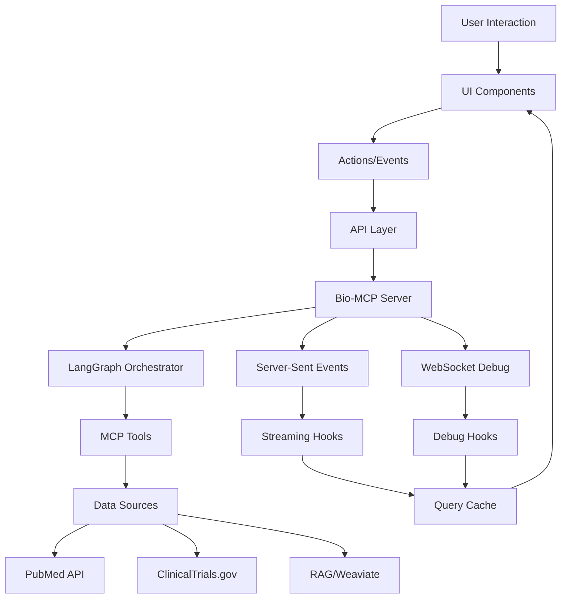

# Bio-MCP Orchestrator UI - Data Flow Architecture

## Overview

This document defines the complete data flow architecture for the Bio-MCP Orchestrator UI, including state management patterns, real-time streaming, caching strategies, and data transformation pipelines.

## Architecture Principles

### Data Flow Philosophy
- **Unidirectional Flow**: Data flows down, events bubble up
- **Single Source of Truth**: Each piece of data has one authoritative source
- **Predictable Updates**: State changes are predictable and traceable
- **Real-time First**: Built for streaming data and live updates
- **Offline Resilient**: Graceful degradation when connectivity is lost

### State Management Strategy
- **Server State**: TanStack Query for API data with caching
- **UI State**: React state for component-specific data
- **Global State**: Context for cross-component communication
- **Form State**: React Hook Form for complex forms
- **Real-time State**: Custom streaming hooks with reconnection logic

## Data Flow Overview



## State Management Architecture

### 1. Server State Management (TanStack Query)

**Query Configuration:**
```typescript
const queryClient = new QueryClient({
  defaultOptions: {
    queries: {
      staleTime: 5 * 60 * 1000, // 5 minutes
      cacheTime: 10 * 60 * 1000, // 10 minutes
      retry: (failureCount, error) => {
        // Don't retry 4xx errors
        if (error.status >= 400 && error.status < 500) return false
        return failureCount < 3
      },
      refetchOnWindowFocus: false,
      refetchOnReconnect: true,
    },
    mutations: {
      retry: 1,
      retryDelay: 1000,
    },
  },
})
```

**Query Keys Structure:**
```typescript
// Hierarchical query keys for efficient invalidation
const queryKeys = {
  // Sessions
  sessions: ['sessions'] as const,
  sessionList: (params: SessionListParams) => ['sessions', 'list', params] as const,
  session: (id: string) => ['sessions', 'detail', id] as const,
  
  // Orchestrator
  orchestrator: ['orchestrator'] as const,
  graphVisualization: () => ['orchestrator', 'graph', 'visualization'] as const,
  
  // Results (cached separately per session)
  results: (sessionId: string) => ['results', sessionId] as const,
  pubmedResults: (sessionId: string) => ['results', sessionId, 'pubmed'] as const,
  trialsResults: (sessionId: string) => ['results', sessionId, 'trials'] as const,
  ragResults: (sessionId: string) => ['results', sessionId, 'rag'] as const,
  
  // Performance
  performance: ['performance'] as const,
  sessionPerformance: (sessionId: string) => ['performance', 'session', sessionId] as const,
}
```

**Custom Query Hooks:**
```typescript
// Sessions queries
export function useSessionList(params: SessionListParams = {}) {
  return useQuery({
    queryKey: queryKeys.sessionList(params),
    queryFn: () => orchestratorApi.getSessions(params),
    keepPreviousData: true,
  })
}

export function useSession(sessionId: string | null) {
  return useQuery({
    queryKey: queryKeys.session(sessionId!),
    queryFn: () => orchestratorApi.getSession(sessionId!),
    enabled: !!sessionId,
  })
}

// Graph visualization (rarely changes)
export function useGraphVisualization() {
  return useQuery({
    queryKey: queryKeys.graphVisualization(),
    queryFn: () => orchestratorApi.getGraphVisualization(),
    staleTime: 10 * 60 * 1000, // 10 minutes
  })
}
```

### 2. Real-time State Management

#### Streaming Results Hook
**Implementation:**
```typescript
export function useStreamingResults(sessionId: string | null) {
  const [streamingState, setStreamingState] = useState<StreamingState>({
    isConnected: false,
    currentEvent: null,
    connectionError: null,
    reconnectAttempts: 0
  })
  
  const [accumulatedResults, setAccumulatedResults] = useState<AccumulatedResults>({})
  const queryClient = useQueryClient()
  const eventSourceRef = useRef<EventSource | null>(null)
  
  // Connection management
  const connectEventSource = useCallback(() => {
    if (!sessionId || eventSourceRef.current) return
    
    const eventSource = new EventSource(`/orchestrator/v1/orchestrator/stream/${sessionId}`)
    eventSourceRef.current = eventSource
    
    // Event handlers
    eventSource.addEventListener('partial_result', (event) => {
      const data = JSON.parse(event.data)
      
      // Accumulate results by source
      setAccumulatedResults(prev => ({
        ...prev,
        [data.source]: {
          ...prev[data.source],
          results: [...(prev[data.source]?.results || []), ...data.results],
          metadata: { ...(prev[data.source]?.metadata || {}), ...data.metadata },
          isStreaming: true,
          lastUpdate: new Date().toISOString()
        }
      }))
      
      // Update query cache with partial results
      queryClient.setQueryData(
        queryKeys.results(sessionId),
        (oldData: any) => ({ ...oldData, [data.source]: data })
      )
    })
    
    eventSource.addEventListener('result', (event) => {
      const finalResult = JSON.parse(event.data)
      
      // Update accumulated results with final data
      setAccumulatedResults(prev => ({
        ...prev,
        ...finalResult,
        isComplete: true
      }))
      
      // Update all related query cache entries
      queryClient.setQueryData(queryKeys.session(sessionId), (oldData: any) => ({
        ...oldData,
        result: finalResult,
        status: 'completed'
      }))
      
      queryClient.setQueryData(queryKeys.results(sessionId), finalResult)
    })
    
    // Connection state handlers
    eventSource.onopen = () => {
      setStreamingState(prev => ({
        ...prev,
        isConnected: true,
        connectionError: null,
        reconnectAttempts: 0
      }))
    }
    
    eventSource.onerror = () => {
      handleConnectionError()
    }
  }, [sessionId, queryClient])
  
  // Automatic reconnection with exponential backoff
  const handleConnectionError = useCallback(() => {
    setStreamingState(prev => ({
      ...prev,
      isConnected: false,
      connectionError: 'Connection lost'
    }))
    
    if (eventSourceRef.current) {
      eventSourceRef.current.close()
      eventSourceRef.current = null
    }
    
    if (streamingState.reconnectAttempts < 5) {
      const backoffDelay = Math.min(1000 * Math.pow(2, streamingState.reconnectAttempts), 30000)
      
      setTimeout(() => {
        setStreamingState(prev => ({
          ...prev,
          reconnectAttempts: prev.reconnectAttempts + 1
        }))
        connectEventSource()
      }, backoffDelay)
    }
  }, [streamingState.reconnectAttempts, connectEventSource])
  
  return {
    ...streamingState,
    accumulatedResults,
    isStreaming: streamingState.isConnected && !accumulatedResults.isComplete
  }
}
```

#### WebSocket Debug Hook
**Implementation:**
```typescript
export function useWebSocketDebug(sessionId: string | null, debugMode: boolean) {
  const [debugState, setDebugState] = useState<DebugState | null>(null)
  const [connectionState, setConnectionState] = useState<ConnectionState>({
    isConnected: false,
    connectionError: null
  })
  
  const websocketRef = useRef<WebSocket | null>(null)
  const messageQueueRef = useRef<DebugCommand[]>([])
  
  // Connection management
  const connectWebSocket = useCallback(() => {
    if (!sessionId || !debugMode || websocketRef.current) return
    
    const protocol = window.location.protocol === 'https:' ? 'wss:' : 'ws:'
    const wsUrl = `${protocol}//${window.location.host}/orchestrator/ws/debug/${sessionId}`
    
    const ws = new WebSocket(wsUrl)
    websocketRef.current = ws
    
    ws.onopen = () => {
      setConnectionState(prev => ({ ...prev, isConnected: true, connectionError: null }))
      
      // Send queued messages
      messageQueueRef.current.forEach(command => {
        ws.send(JSON.stringify(command))
      })
      messageQueueRef.current = []
    }
    
    ws.onmessage = (event) => {
      const message: DebugMessage = JSON.parse(event.data)
      handleDebugMessage(message)
    }
    
    ws.onclose = () => {
      setConnectionState(prev => ({ ...prev, isConnected: false }))
      websocketRef.current = null
      
      // Attempt reconnection if still in debug mode
      if (debugMode) {
        setTimeout(connectWebSocket, 3000)
      }
    }
    
    ws.onerror = (error) => {
      setConnectionState(prev => ({
        ...prev,
        connectionError: 'Debug connection failed'
      }))
    }
  }, [sessionId, debugMode])
  
  // Command sending with queuing
  const sendCommand = useCallback((command: DebugCommand) => {
    if (websocketRef.current?.readyState === WebSocket.OPEN) {
      websocketRef.current.send(JSON.stringify(command))
    } else {
      messageQueueRef.current.push(command)
    }
  }, [])
  
  return {
    debugState,
    ...connectionState,
    setBreakpoint: (nodeId: string, enabled: boolean) => {
      sendCommand({
        type: 'set_breakpoint',
        node_name: nodeId,
        enabled,
        timestamp: new Date().toISOString()
      })
    },
    stepExecution: (nodeId: string) => {
      sendCommand({
        type: 'step',
        node_name: nodeId,
        timestamp: new Date().toISOString()
      })
    }
    // ... other debug methods
  }
}
```

### 3. Form State Management

**Query Builder Form:**
```typescript
export function useOrchestratorForm() {
  const { control, handleSubmit, watch, setValue, reset } = useForm<OrchestrationRequest>({
    defaultValues: {
      query: '',
      config: {
        time_budget_ms: 5000,
        fetch_policy: 'cache_then_network',
        max_parallel_calls: 5,
        enable_partial_results: true
      },
      debug_mode: false,
      session_name: ''
    },
    resolver: zodResolver(orchestrationRequestSchema)
  })
  
  const [extractedEntities, setExtractedEntities] = useState<ExtractedEntities>({})
  const [isValidating, setIsValidating] = useState(false)
  
  const query = watch('query')
  
  // Entity extraction effect
  useEffect(() => {
    if (query && query.length > 10) {
      const timeoutId = setTimeout(() => {
        extractEntities(query).then(setExtractedEntities)
      }, 500) // Debounce entity extraction
      
      return () => clearTimeout(timeoutId)
    }
  }, [query])
  
  return {
    control,
    handleSubmit,
    watch,
    setValue,
    reset,
    extractedEntities,
    isValidating,
    setIsValidating
  }
}
```

## Data Transformation Pipelines

### 1. Result Normalization

**PubMed Results Processing:**
```typescript
export function normalizePubMedResults(rawResults: any): PubMedSearchResults {
  return {
    results: rawResults.results.map((article: any) => ({
      pmid: article.pmid,
      title: article.title,
      abstract: article.abstract || '',
      authors: Array.isArray(article.authors) ? article.authors : [],
      journal: article.journal || 'Unknown',
      publication_date: article.pub_date || '',
      doi: article.doi,
      pmc_id: article.pmc_id,
      mesh_terms: article.mesh_terms || [],
      keywords: article.keywords || [],
      citation_count: article.citation_count || 0,
      impact_factor: article.journal_impact_factor,
      quality_score: calculateArticleQuality(article)
    })),
    total_results: rawResults.total || rawResults.results.length,
    search_terms: rawResults.search_terms || [],
    metadata: {
      query_translation: rawResults.query_translation || '',
      search_time_ms: rawResults.search_time || 0,
      cache_hit: rawResults.cache_hit || false
    }
  }
}

function calculateArticleQuality(article: any): number {
  let score = 0.5 // Base score
  
  // Journal impact factor bonus
  if (article.journal_impact_factor > 10) score += 0.3
  else if (article.journal_impact_factor > 5) score += 0.2
  else if (article.journal_impact_factor > 2) score += 0.1
  
  // Citation count bonus
  if (article.citation_count > 100) score += 0.2
  else if (article.citation_count > 50) score += 0.1
  
  // Recency bonus (last 3 years)
  const pubYear = new Date(article.pub_date).getFullYear()
  const currentYear = new Date().getFullYear()
  if (currentYear - pubYear <= 3) score += 0.15
  
  // Abstract completeness
  if (article.abstract && article.abstract.length > 200) score += 0.1
  
  return Math.min(score, 1.0)
}
```

**Clinical Trials Processing:**
```typescript
export function normalizeClinicalTrialsResults(rawResults: any): ClinicalTrialsSearchResults {
  return {
    results: rawResults.results.map((trial: any) => ({
      nct_id: trial.nct_id,
      title: trial.official_title || trial.brief_title,
      brief_summary: trial.brief_summary || '',
      detailed_description: trial.detailed_description,
      conditions: Array.isArray(trial.conditions) ? trial.conditions : [trial.conditions].filter(Boolean),
      interventions: Array.isArray(trial.interventions) ? trial.interventions : [trial.interventions].filter(Boolean),
      phase: normalizePhase(trial.phase),
      status: normalizeStatus(trial.overall_status),
      enrollment: {
        target: trial.enrollment_count || 0,
        actual: trial.actual_enrollment,
        type: trial.enrollment_type || 'estimated'
      },
      dates: {
        start_date: trial.start_date || '',
        completion_date: trial.completion_date,
        last_update: trial.last_update_posted || ''
      },
      sponsors: {
        lead_sponsor: trial.lead_sponsor?.name || '',
        collaborators: trial.collaborators?.map((c: any) => c.name) || []
      },
      locations: normalizeLocations(trial.locations),
      investment_score: calculateInvestmentScore(trial),
      relevance_score: trial.relevance_score || 0.5,
      risk_assessment: assessTrialRisk(trial)
    })),
    total_found: rawResults.total_count || rawResults.results.length,
    filtered_count: rawResults.results.length,
    filters_applied: rawResults.filters || {},
    search_terms: rawResults.search_terms || []
  }
}

function calculateInvestmentScore(trial: any): number {
  let score = 0.4 // Base score
  
  // Phase scoring (later phases score higher)
  switch (trial.phase?.toLowerCase()) {
    case 'phase 3':
    case 'phase iii':
      score += 0.4
      break
    case 'phase 2':
    case 'phase ii':
      score += 0.3
      break
    case 'phase 1':
    case 'phase i':
      score += 0.1
      break
  }
  
  // Status scoring
  if (trial.overall_status === 'Recruiting' || trial.overall_status === 'Active, not recruiting') {
    score += 0.2
  }
  
  // Sponsor type (industry-sponsored gets bonus)
  if (trial.lead_sponsor?.agency_class === 'Industry') {
    score += 0.15
  }
  
  // Large enrollment suggests confidence
  if (trial.enrollment_count > 1000) score += 0.1
  else if (trial.enrollment_count > 500) score += 0.05
  
  return Math.min(score, 1.0)
}
```

### 2. Real-time Data Aggregation

**Streaming Results Accumulator:**
```typescript
export class StreamingResultsAccumulator {
  private results: Map<string, any> = new Map()
  private metadata: Map<string, any> = new Map()
  private subscribers: ((results: any) => void)[] = []
  
  addPartialResults(source: string, data: any) {
    const existing = this.results.get(source) || { results: [], metadata: {} }
    
    const updated = {
      results: [...existing.results, ...data.results],
      metadata: { ...existing.metadata, ...data.metadata },
      isStreaming: true,
      lastUpdate: new Date().toISOString(),
      totalReceived: existing.results.length + data.results.length
    }
    
    this.results.set(source, updated)
    this.notifySubscribers()
  }
  
  finalizeResults(finalData: any) {
    // Merge streaming results with final synthesized data
    const consolidated = {
      ...finalData,
      isComplete: true,
      streamingSources: Object.fromEntries(this.results)
    }
    
    this.notifySubscribers(consolidated)
  }
  
  subscribe(callback: (results: any) => void) {
    this.subscribers.push(callback)
    return () => {
      this.subscribers = this.subscribers.filter(sub => sub !== callback)
    }
  }
  
  private notifySubscribers(data?: any) {
    const currentResults = data || Object.fromEntries(this.results)
    this.subscribers.forEach(callback => callback(currentResults))
  }
  
  getResults() {
    return Object.fromEntries(this.results)
  }
  
  clear() {
    this.results.clear()
    this.metadata.clear()
  }
}
```

## Caching Strategy

### 1. Query Cache Configuration

**Cache Hierarchy:**
```typescript
// Different cache times based on data mutability
const cacheConfig = {
  // Static/rarely changing data
  graphVisualization: {
    staleTime: 10 * 60 * 1000,  // 10 minutes
    cacheTime: 30 * 60 * 1000,  // 30 minutes
  },
  
  // Session data (changes frequently)
  sessionList: {
    staleTime: 30 * 1000,       // 30 seconds
    cacheTime: 5 * 60 * 1000,   // 5 minutes
  },
  
  // Session details (real-time updates)
  sessionDetails: {
    staleTime: 0,               // Always stale
    cacheTime: 2 * 60 * 1000,   // 2 minutes
  },
  
  // Results (cacheable but session-specific)
  results: {
    staleTime: 5 * 60 * 1000,   // 5 minutes
    cacheTime: 15 * 60 * 1000,  // 15 minutes
  }
}
```

**Cache Invalidation Strategy:**
```typescript
export function useOrchestratorMutations() {
  const queryClient = useQueryClient()
  
  const executeOrchestration = useMutation({
    mutationFn: orchestratorApi.executeQuery,
    onSuccess: (newSession) => {
      // Add new session to sessions list cache
      queryClient.setQueryData(
        queryKeys.sessionList({}),
        (oldData: any) => ({
          ...oldData,
          sessions: [newSession, ...(oldData?.sessions || [])],
          total: (oldData?.total || 0) + 1
        })
      )
      
      // Create cache entry for new session
      queryClient.setQueryData(
        queryKeys.session(newSession.session_id),
        newSession
      )
      
      // Invalidate session list to ensure consistency
      queryClient.invalidateQueries({ queryKey: queryKeys.sessions })
    }
  })
  
  const deleteSession = useMutation({
    mutationFn: orchestratorApi.deleteSession,
    onSuccess: (_, sessionId) => {
      // Remove from cache
      queryClient.removeQueries({ queryKey: queryKeys.session(sessionId) })
      queryClient.removeQueries({ queryKey: queryKeys.results(sessionId) })
      
      // Update session list cache
      queryClient.setQueryData(
        queryKeys.sessionList({}),
        (oldData: any) => ({
          ...oldData,
          sessions: oldData?.sessions.filter((s: any) => s.session_id !== sessionId) || [],
          total: Math.max(0, (oldData?.total || 1) - 1)
        })
      )
    }
  })
  
  return {
    executeOrchestration,
    deleteSession
  }
}
```

### 2. Client-side Storage

**Persistent State Management:**
```typescript
// Local storage for user preferences
export const persistentStorage = {
  getPreferences(): UserPreferences {
    const stored = localStorage.getItem('orchestrator-preferences')
    return stored ? JSON.parse(stored) : DEFAULT_PREFERENCES
  },
  
  setPreferences(preferences: UserPreferences) {
    localStorage.setItem('orchestrator-preferences', JSON.stringify(preferences))
  },
  
  getRecentQueries(): string[] {
    const stored = localStorage.getItem('recent-queries')
    return stored ? JSON.parse(stored) : []
  },
  
  addRecentQuery(query: string) {
    const recent = this.getRecentQueries()
    const updated = [query, ...recent.filter(q => q !== query)].slice(0, 10)
    localStorage.setItem('recent-queries', JSON.stringify(updated))
  }
}

// Session storage for temporary data
export const sessionStorage = {
  getCurrentSession(): OrchestrationSession | null {
    const stored = window.sessionStorage.getItem('current-session')
    return stored ? JSON.parse(stored) : null
  },
  
  setCurrentSession(session: OrchestrationSession | null) {
    if (session) {
      window.sessionStorage.setItem('current-session', JSON.stringify(session))
    } else {
      window.sessionStorage.removeItem('current-session')
    }
  }
}
```

## Error Handling and Recovery

### 1. Error Boundaries

**Global Error Boundary:**
```typescript
export class GlobalErrorBoundary extends React.Component<
  { children: React.ReactNode },
  { hasError: boolean; error: Error | null }
> {
  constructor(props: { children: React.ReactNode }) {
    super(props)
    this.state = { hasError: false, error: null }
  }
  
  static getDerivedStateFromError(error: Error) {
    return { hasError: true, error }
  }
  
  componentDidCatch(error: Error, errorInfo: React.ErrorInfo) {
    console.error('Global error boundary caught error:', error, errorInfo)
    
    // Report to error tracking service
    if (process.env.NODE_ENV === 'production') {
      // reportError(error, errorInfo)
    }
  }
  
  render() {
    if (this.state.hasError) {
      return (
        <ErrorFallback
          error={this.state.error}
          onRetry={() => this.setState({ hasError: false, error: null })}
        />
      )
    }
    
    return this.props.children
  }
}
```

### 2. Network Error Recovery

**Automatic Retry with Exponential Backoff:**
```typescript
export function createRetryableQuery<T>(
  queryFn: () => Promise<T>,
  options: RetryOptions = {}
) {
  const {
    maxRetries = 3,
    baseDelay = 1000,
    maxDelay = 30000,
    retryCondition = (error: any) => error.status >= 500
  } = options
  
  return async (): Promise<T> => {
    let lastError: Error
    
    for (let attempt = 0; attempt <= maxRetries; attempt++) {
      try {
        return await queryFn()
      } catch (error: any) {
        lastError = error
        
        if (attempt === maxRetries || !retryCondition(error)) {
          throw error
        }
        
        const delay = Math.min(baseDelay * Math.pow(2, attempt), maxDelay)
        await new Promise(resolve => setTimeout(resolve, delay))
      }
    }
    
    throw lastError!
  }
}
```

### 3. Connection Recovery

**Streaming Connection Recovery:**
```typescript
export function useConnectionRecovery(
  connectionState: { isConnected: boolean; error: string | null },
  reconnectFn: () => void
) {
  const [isRecovering, setIsRecovering] = useState(false)
  const [recoveryAttempts, setRecoveryAttempts] = useState(0)
  const maxAttempts = 5
  
  const attemptRecovery = useCallback(async () => {
    if (isRecovering || recoveryAttempts >= maxAttempts) return
    
    setIsRecovering(true)
    setRecoveryAttempts(prev => prev + 1)
    
    try {
      await reconnectFn()
      setRecoveryAttempts(0) // Reset on successful connection
    } catch (error) {
      console.error('Recovery attempt failed:', error)
    } finally {
      setIsRecovering(false)
    }
  }, [isRecovering, recoveryAttempts, reconnectFn])
  
  // Automatic recovery on connection loss
  useEffect(() => {
    if (!connectionState.isConnected && connectionState.error && !isRecovering) {
      const delay = Math.min(1000 * Math.pow(2, recoveryAttempts), 30000)
      const timeoutId = setTimeout(attemptRecovery, delay)
      return () => clearTimeout(timeoutId)
    }
  }, [connectionState.isConnected, connectionState.error, isRecovering, attemptRecovery, recoveryAttempts])
  
  return {
    isRecovering,
    recoveryAttempts,
    canRetry: recoveryAttempts < maxAttempts,
    manualRecovery: attemptRecovery
  }
}
```

## Performance Optimization

### 1. Memory Management

**Result Set Virtualization:**
```typescript
export function useVirtualizedResults<T>(
  items: T[],
  itemHeight: number,
  containerHeight: number
) {
  const [scrollTop, setScrollTop] = useState(0)
  
  const visibleRange = useMemo(() => {
    const startIndex = Math.floor(scrollTop / itemHeight)
    const visibleCount = Math.ceil(containerHeight / itemHeight)
    const endIndex = Math.min(startIndex + visibleCount + 1, items.length)
    
    return { startIndex, endIndex }
  }, [scrollTop, itemHeight, containerHeight, items.length])
  
  const visibleItems = useMemo(() => {
    return items.slice(visibleRange.startIndex, visibleRange.endIndex).map((item, index) => ({
      item,
      index: visibleRange.startIndex + index
    }))
  }, [items, visibleRange])
  
  const totalHeight = items.length * itemHeight
  const offsetY = visibleRange.startIndex * itemHeight
  
  return {
    visibleItems,
    totalHeight,
    offsetY,
    onScroll: (e: React.UIEvent<HTMLDivElement>) => {
      setScrollTop(e.currentTarget.scrollTop)
    }
  }
}
```

### 2. Debounced Operations

**Search and Filter Debouncing:**
```typescript
export function useDebouncedSearch(
  searchTerm: string,
  delay: number = 300
) {
  const [debouncedTerm, setDebouncedTerm] = useState(searchTerm)
  
  useEffect(() => {
    const timeoutId = setTimeout(() => {
      setDebouncedTerm(searchTerm)
    }, delay)
    
    return () => clearTimeout(timeoutId)
  }, [searchTerm, delay])
  
  return debouncedTerm
}

export function useDebouncedCallback<T extends (...args: any[]) => any>(
  callback: T,
  delay: number,
  deps: React.DependencyList
): T {
  const callbackRef = useRef(callback)
  
  useEffect(() => {
    callbackRef.current = callback
  })
  
  return useMemo(() => {
    const debouncedFn = debounce((...args: Parameters<T>) => {
      return callbackRef.current(...args)
    }, delay)
    
    return debouncedFn as T
  }, [delay, ...deps])
}
```

## Data Security and Privacy

### 1. Data Sanitization

**Input Sanitization:**
```typescript
export function sanitizeQueryInput(input: string): string {
  // Remove potential XSS vectors
  return input
    .replace(/<script\b[^<]*(?:(?!<\/script>)<[^<]*)*<\/script>/gi, '')
    .replace(/<[^>]*>/g, '') // Remove HTML tags
    .replace(/javascript:/gi, '')
    .replace(/on\w+=/gi, '')
    .trim()
    .slice(0, 1000) // Limit length
}

export function sanitizeSessionName(name: string): string {
  return name
    .replace(/[<>\"'/\\]/g, '') // Remove dangerous characters
    .trim()
    .slice(0, 100) // Limit length
}
```

### 2. Data Encryption for Storage

**Sensitive Data Handling:**
```typescript
// Simple encryption for local storage (not for production security)
export const secureStorage = {
  encrypt(data: string, key: string): string {
    // In production, use proper encryption library
    return btoa(data + key)
  },
  
  decrypt(encryptedData: string, key: string): string {
    try {
      const decrypted = atob(encryptedData)
      return decrypted.replace(key, '')
    } catch {
      return ''
    }
  },
  
  setSecureItem(key: string, value: any, encryptionKey: string) {
    const encrypted = this.encrypt(JSON.stringify(value), encryptionKey)
    localStorage.setItem(key, encrypted)
  },
  
  getSecureItem(key: string, encryptionKey: string): any {
    const encrypted = localStorage.getItem(key)
    if (!encrypted) return null
    
    try {
      const decrypted = this.decrypt(encrypted, encryptionKey)
      return JSON.parse(decrypted)
    } catch {
      return null
    }
  }
}
```

## Monitoring and Analytics

### 1. Performance Monitoring

**Real-time Performance Tracking:**
```typescript
export class PerformanceTracker {
  private metrics: Map<string, PerformanceMetric[]> = new Map()
  private observers: PerformanceObserver[] = []
  
  startTracking() {
    // Track navigation timing
    this.trackNavigationTiming()
    
    // Track resource loading
    this.trackResourceTiming()
    
    // Track custom metrics
    this.trackCustomMetrics()
  }
  
  private trackNavigationTiming() {
    const navTiming = performance.getEntriesByType('navigation')[0] as PerformanceNavigationTiming
    if (navTiming) {
      this.recordMetric('page_load', {
        duration: navTiming.loadEventEnd - navTiming.fetchStart,
        domContentLoaded: navTiming.domContentLoadedEventEnd - navTiming.fetchStart,
        firstPaint: this.getFirstPaint(),
        largestContentfulPaint: this.getLargestContentfulPaint()
      })
    }
  }
  
  recordApiCall(endpoint: string, duration: number, success: boolean) {
    this.recordMetric('api_call', {
      endpoint,
      duration,
      success,
      timestamp: Date.now()
    })
  }
  
  recordUserInteraction(action: string, component: string, duration?: number) {
    this.recordMetric('user_interaction', {
      action,
      component,
      duration,
      timestamp: Date.now()
    })
  }
  
  getMetrics(type?: string): PerformanceMetric[] {
    if (type) {
      return this.metrics.get(type) || []
    }
    
    const allMetrics: PerformanceMetric[] = []
    for (const metrics of this.metrics.values()) {
      allMetrics.push(...metrics)
    }
    return allMetrics
  }
  
  private recordMetric(type: string, data: any) {
    if (!this.metrics.has(type)) {
      this.metrics.set(type, [])
    }
    
    this.metrics.get(type)!.push({
      type,
      timestamp: Date.now(),
      data
    })
  }
}
```

This comprehensive data flow architecture provides a robust foundation for managing state, handling real-time updates, implementing caching strategies, and ensuring optimal performance in the Bio-MCP Orchestrator UI.